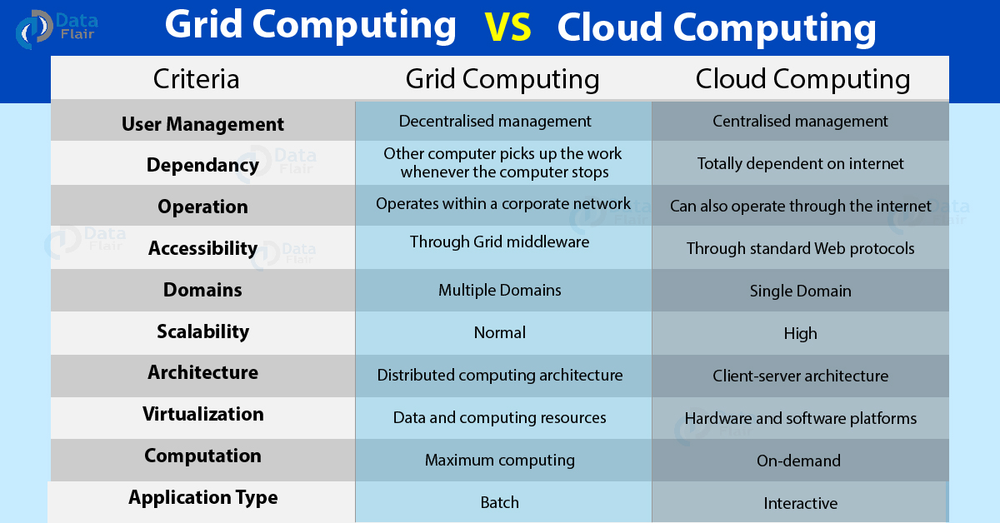

# Exercise: Characterization of distributed systems
1. Discuss the pros and cons of distributed versus centralized systems.
    - Centralized systems are simpler, but distributed systems can be more efficient and solve more problems.
    - Distributed systems can solve problems that centralized can't.
    - Distributed are more complex and can have different types of errors.
1. Discuss the relationship between distributed systems, parallel systems, cluster computing systems, grid computing systems, and cloud computing systems.
    - Distributed vs parallel systems:
        - Placement of memory. In parallel there can be shared memory.
    - Cluster computing systems, grid computing systems, and cloud computing systems:
        - Can be considered as special cases of distributed systems.
        - Google the specific types.
        - Difference between grid and cloud:
        
1. Discuss the relationship between distributed, pervasive, and ubiquitous systems.
    - Pervasive = ubiquitous
    - No comment.
1. Discuss the relationship between parallel and concurrent systems
    - Concurrent is about a system being able to run two or more actions/tasks at the same time, where parallel is about actions executing simultaneously.
        - Concurrent can be run sequentially through a scheduler or in parallel if multiple threads/cores are supported.
1. Discuss pros and cons of different forms of transparency in distributed systems.
    - See slide 27.
    - With distributed systems is it possible to hide the details as shown in the table.
        - I.e. where the system is located.
1. Discuss the fallacies of distributed systems
    - See slide 39.
    - Errors in a distributed system can be more severe than in a centralized system. I.e. when AWS goes down everything goes down.
1. Discuss current examples of noteworthy distributed systems.
    - In ranked order of noteworthy-ness:
        1. Carstens GPU Cluster
        1. AWS
        1. Microsoft Azure
1. Discuss current examples of noteworthy pervasive systems.
    - Pervasive system = allestedsnærverende system
    - Smart devices (i.e. alarms, speakers)
    - Apple watch
1. Discuss Flynn’s taxonomy in general and specifically in relation to distributed systems.
    - See slide 51.
    - Distributed systems are MIMD - multiple instruction streams and multiple data streams.
1. Make a small processing-step example for each of Flynn’s four computer architectural classes SISD, SIMD, MISD and MIMD by taking the concepts instruction stream”, “data stream” and “processing unit” into account
    - See slide 51 - 55 and onward.
1. Discuss the consequences of Amdahl’s law for distributed systems.
    - There is a limit on how much faster you can make your distributed system based on the critical path.
        - It can never be faster than 1/f where f indicates the percentage of non-parallelizable part of the problem.
1. Discuss the relationship between Amdahl’s and Gustafson’s laws and the consequences of Gustafson’s law for distributed systems
    - Amdahls law flipped.
    - If the problem was to be executed sequentially, how much slower would it be.
1. Discuss the consequences of Moore’s, Koomey’s and Kryder’s laws for distributed systems.
    - Moore's: The individual nodes will be faster.
        - A problem that needed to be solved through a distributed system in the past may be solvable through a centralized system in the future (if it is possible).
    - Koomey's: More computing pr. Joule. Everything will be cheaper. It is easier to execute on battery power.
    - Kryder's law: Disk capacity becomes cheaper. Maybe makes centralized systems more attractive.
1. Discuss three types of hardware resources, three types of data resources, and three types of software resources that can usefully be shared. Give examples of their sharing as it occurs in practice in distributed systems.
    - HW:
        1. Power supplies can perhaps be shared among nodes in the DS.
        1. Network.
        1. Display.
        1. Network data storage. (Note: they also have private data storage that is not shared.)
    - Data:
        - From his slides:
            1. Shared memory in the system. Accessed through communication.
                - I.e. a database.
            1. Files
            1. Databases
    - SW:
        1. Maybe the scheduler.
1. Consider the WWW as an example to illustrate the concepts of clients, servers, and resource sharing. Discuss the pros and cons of the technologies HTML, URL and HTTP for information browsing? Are any of these technologies suitable as a basis for clientserver computing in general?
    - WWW is designed for humans to use. There is a lot of overhead which may not be necessary in a distributed system unless we are talking about the presentation.
    - HTTP is widely used i.e. for web APIs. So it can be used with distributed systems.
    