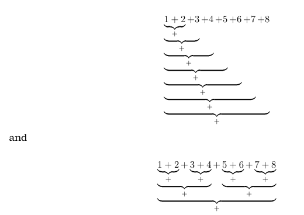

# Exercise: Critical path
1. Consider an integer sequence $s=(i)_{i=1}^{8}$ of length $|s| = 8$. Two alternatives for adding the elements of s are:

- Determine the length of the critical path for both computational alternatives.
    - Critical path for the first is length 7.
    - Critical path for the second is length 3.
- Determine the length of the critical path for both computational alternatives for a sequence of length n:
    - Critical path for the first is length n - 1.
    - Critical path for the second is $ceil(log_2(n))$.
        - "In the second compute-alternative we do as many independent additions in parallel as possible resulting in a binary task tree structure. The critical path is equal to the height of this tree which is $ceil(log_2(n))$."