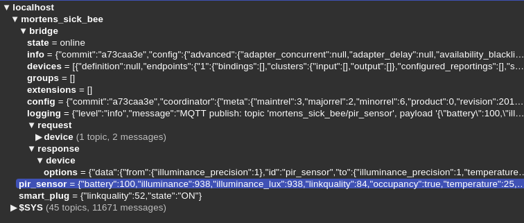

# Assumptions

- A Zigbee network is assumed to be configured like on the picture above.
- That is the zigbee2mqtt bridge is configured to have: `base_topic: mortens_sick_bee` and a Xiami Agara RTCGQ11LM is expected to be configured with the `friendly_name: pir_sensor`. See the file `configuration.yaml`.
- Assumed to have the blinkt hat on the RPi.